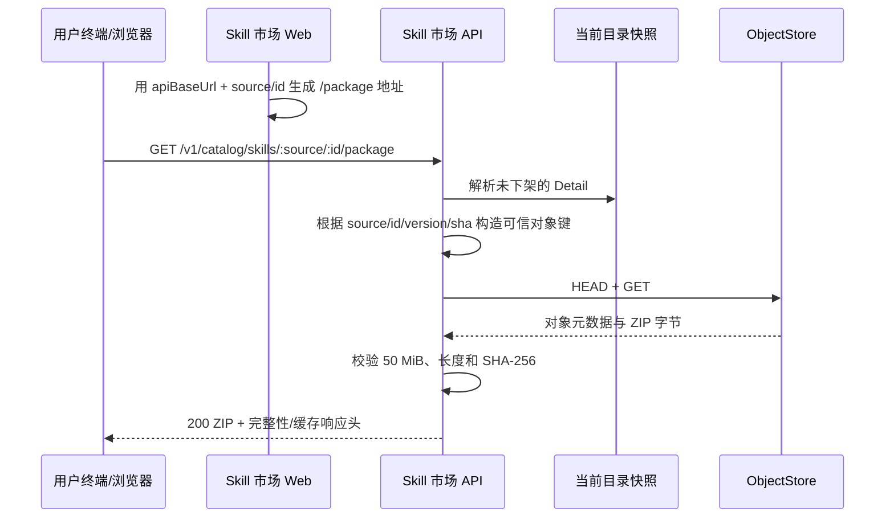

# Skill 市场同源安装包交付设计

## 背景

Skill 市场当前把安装提示词和“下载 ZIP”按钮指向 OSS 公网样式地址。该 OSS 使用企业内网 CA 签发的证书；未安装企业根 CA 的终端执行普通 `curl` 时会收到 `self signed certificate in certificate chain`，只能临时使用 `-k`。SHA-256 能验证下载后的文件完整性，但不能替代传输阶段的服务端身份验证，也不适合作为所有使用者的默认操作。

本设计让 Skill 市场服务自身交付目录中已经同步完成的 ZIP。浏览器和终端只访问市场 API，不再直接访问 OSS，因此无需每台使用者设备安装内网 CA，也无需在提示词中使用 `curl -k`。

## 目标

- 为目录中的 Skill 提供由市场 API 交付的 GET 和 HEAD 安装包端点。
- 服务端只根据可信目录元数据构造对象存储键，不接受、解析或转发客户端提供的上游 URL。
- 返回安装包前校验声明大小、实际大小和 SHA-256。
- 安装提示词和“下载 ZIP”按钮使用同一个市场 API 包地址。
- 兼容 SkillHub、企业和社区三个来源的现有包对象布局。
- 单包最大 50 MiB，避免无界内存占用。

## 非目标

- 不改变 SkillHub 同步、社区发布或目录快照的调度机制。
- 不让 API 充当任意 URL 的通用代理。
- 不在 API 本地磁盘或数据库中增加包缓存。
- 第一版不支持 Range、断点续传或条件请求。服务端会在发送响应前完整读取并校验不超过 50 MiB 的包。
- 不删除现有 `/download` JSON 元数据端点；它继续保留以兼容已有客户端，但 Web 不再用它跳转 OSS。

## 方案选择

采用“市场 API 从既有 ObjectStore 读取并校验后返回”的方案。

未采用的方案：

- **客户端继续直连 OSS并使用 `-k`**：部署简单，但禁用了服务器身份验证，且每个使用者都要承担额外操作。
- **要求所有终端安装企业根 CA**：传输安全完整，但依赖 IT 下发和终端配置，无法由市场服务独立解决。
- **API 302 重定向到 OSS**：请求最终仍落到相同证书链，不能解决问题。
- **API 按任意 URL 反向代理**：存在 SSRF 和开放代理风险，也绕过目录边界。

## HTTP 契约

新增两个公开端点：

```text
GET  /v1/catalog/skills/:source/:id/package
HEAD /v1/catalog/skills/:source/:id/package
```

`source` 继续使用 Protocol 中的 `SkillMarket.Source`，`id` 使用现有目录键规则。路由先从当前目录快照查找 Skill；不存在或已下架时返回 404。

成功的 GET 返回 ZIP 字节，HEAD 执行相同的存在性和完整性校验，但不返回响应体。两者都返回：

```text
Content-Type: application/zip
Content-Disposition: attachment; filename="<source>-<id>-<version>.zip"
Content-Length: <verified byte length>
ETag: "<sha256>"
X-Content-SHA256: <sha256>
Cache-Control: public, max-age=31536000, immutable
X-Content-Type-Options: nosniff
```

文件名只保留 ASCII 字母、数字、点、下划线和连字符，其他字符替换为下划线，避免响应头注入。

错误响应仍是 JSON：

| 场景 | 状态码 | 对外错误码 |
| --- | ---: | --- |
| Skill 不存在或已下架 | 404 | `skill-market-not-found` |
| 目录声明大小或存储对象大小超过 50 MiB | 413 | `skill-market-package-too-large` |
| 对象不存在、读取失败、大小不一致或 SHA-256 不一致 | 502 | `skill-market-package-unavailable` |
| 目录快照不可读取 | 503 | `market-unavailable` |

502 响应不暴露对象键、OSS 地址或底层 SDK 错误。服务端日志和指标记录来源、Skill ID、失败阶段和请求 ID，便于排查。

## 服务端组件

### Protocol

在 `packages/protocol/src/groups/skill-market-catalog.ts` 中增加 GET/HEAD endpoint：

- GET success 使用 `Schema.Uint8Array.pipe(HttpApiSchema.asUint8Array())`。
- HEAD success 使用无响应体 schema。
- 增加 413 和 502 的显式错误 schema；404 复用目录 not-found 语义。

这是公开 Protocol 变更，完成后必须在 `packages/client` 中执行 `bun run generate`，不得手工修改 `src/generated` 或 `src/generated-effect`。

### 可信对象键解析

新增服务端包读取边界，输入只包含已从当前快照解析出的 `SkillMarket.Detail`、公共 OSS prefix 和 `ObjectStore`。它不接收请求 URL，也不读取 `detail.package.url` 来决定存储位置。

现有对象布局如下：

| 来源 | 服务端构造的对象键 |
| --- | --- |
| `skillhub`、`enterprise` | `<public-prefix>/packages/<sha256>.zip` |
| `community` | `<public-prefix>/packages/community/<id>/<version>/<sha256>.zip` |

社区键沿用当前发布器的布局，`id`、`version` 和 SHA 均来自已经通过 Schema 校验的目录详情，并复用社区发布代码现有的对象键规则，避免两处规则漂移。这个兼容分支保证已发布的社区 Skill 无需迁移即可下载。所有分支都固定在公共 prefix 下，无法越界到私有提交对象。

### 读取与校验

包读取器按以下顺序工作：

1. 检查目录声明的 `package.size`；超过 50 MiB 立即返回 413。
2. 对可信对象键执行 `store.head`；对象大小超过限制返回 413，与目录声明不一致返回 502。
3. 执行 `store.get`，将完整对象读入内存。读取异常统一映射为 502。
4. 再次比较字节长度与目录声明、HEAD 结果；不一致返回 502。
5. 使用 Bun 原生 SHA-256 对字节计算摘要，并用恒定格式的小写十六进制字符串与目录 SHA 比较；不一致返回 502。
6. 只有全部校验成功后才创建响应，确保不会先向客户端发送部分未验证内容。

GET 和 HEAD 共用这一流程。HEAD 虽然不返回响应体，也会读取并校验对象，保证它不会对缺失或损坏的包错误返回 200。50 MiB 上限使该行为的内存和网络成本可控。

### 路由接线

`MarketHttpOptions` 增加公共包读取所需的公共 prefix；现有 `store` 已实现 `ObjectStore.get/head`，无需创建第二个 OSS 客户端。`server.ts` 将 `config.ossPrefix` 注入目录 HTTP 组。

Effect HttpApi handler 使用 raw response 写入动态下载头，GET 返回已校验字节，HEAD 返回空 body。遗留的 `createCatalogHandler` 也注入同一包读取器并实现相同契约，使现有单元测试入口与生产 HttpApi 不产生行为差异。

现有全局 CORS 规则已经允许 GET、HEAD 和 OPTIONS；包响应继续经过该中间件。

## Web 组件

在 Web 侧增加唯一的包 URL 构造函数：

```text
<apiBaseUrl>/v1/catalog/skills/<source>/<encoded-id>/package
```

它使用运行时解析后的 `apiBaseUrl`。生产部署未单独配置 API 地址时，该值就是当前页面 origin；开发或分离部署显式配置 API 地址时，则使用配置的市场 API 地址。无论哪种情况都不会使用 `detail.package.url`。

详情页的两个入口统一使用该函数：

- 安装提示词中的“内网下载”地址。
- “下载 ZIP”按钮的跳转地址。

详情页和版本、SHA-256 仍来自目录详情。共享 App 的 `installPrompt` 格式化函数无需改变，只替换传入的 `downloadUrl`。现有 data source 的 `/download` 方法保留兼容，但 Web 下载操作不再调用它。

## 数据流



## 测试策略

### Protocol 与生成客户端

- Protocol 能描述 GET ZIP 和 HEAD 无 body 端点。
- 413、502、404 错误状态进入 OpenAPI/客户端契约。
- 运行客户端生成，并通过生成内容的现有快照/身份测试。

### 服务端

- GET 返回正确 ZIP 字节和全部下载响应头。
- HEAD 返回与 GET 相同的元数据头、空 body，并执行对象校验。
- 不存在和已下架 Skill 返回 404，且不访问对象存储。
- 声明大小或对象大小超过 50 MiB 返回 413。
- 对象缺失、HEAD/GET 大小不一致、目录大小不一致和 SHA 不一致返回 502。
- SkillHub/企业使用扁平 SHA 键，社区使用现有社区键。
- 路由不能通过 path、query 或目录中的 `package.url` 访问任意上游地址或私有 prefix。
- GET 在完整校验结束前不产生成功响应。

### Web

- 安装提示词中的下载地址是市场 API `/package` 地址，不包含 OSS host，也不包含 `-k`。
- “下载 ZIP”按钮使用同一个 `/package` 地址，不先请求 `/download` 元数据。
- 特殊字符 ID 被正确编码。
- 显式 API base URL 和默认页面 origin 两种运行时配置都生成正确地址。

### 发布验证

部署 API 和 Web 后，以 `ppt-optimizer` 做真实链路验证：

```sh
curl -fL -o ppt-optimizer.zip \
  http://10.246.13.226:4211/v1/catalog/skills/skillhub/ppt-optimizer/package
shasum -a 256 ppt-optimizer.zip
```

命令不得使用 `-k`，返回摘要必须为：

```text
8ff40cbea13c9269ca5ad7eefab3090f27e15f5be25c5c4c2138ffbf25a71976
```

同时验证 HEAD、错误状态、安装提示词和浏览器下载按钮。若生产 API 实际使用独立 origin，则以上 URL 以运行时 API base URL 为准。

## 发布与回滚

先发布包含新 Protocol/Server 端点的 API，再发布引用该端点的 Web，避免 Web 先出现 404。现有 `/download` 元数据端点和 OSS 对象保持不变，因此回滚 Web 可立即恢复旧行为；回滚 Server 前应先回滚 Web。

该功能不修改同步任务、数据库 schema 或目录格式，不需要数据迁移。失败只影响包交付端点，不影响目录浏览和后续同步。
